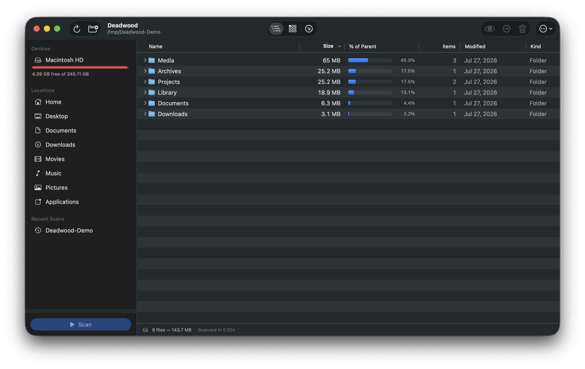
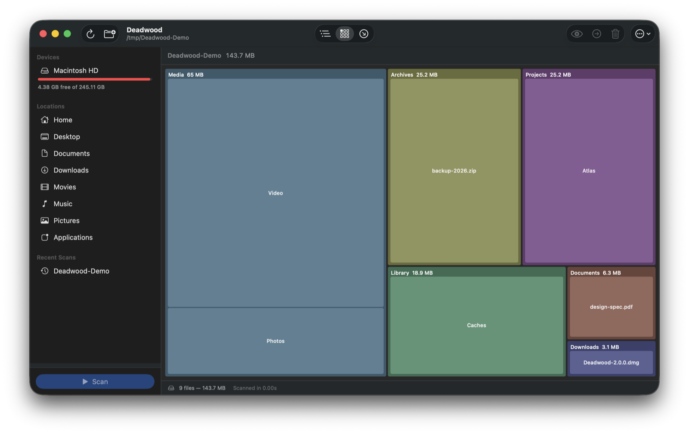
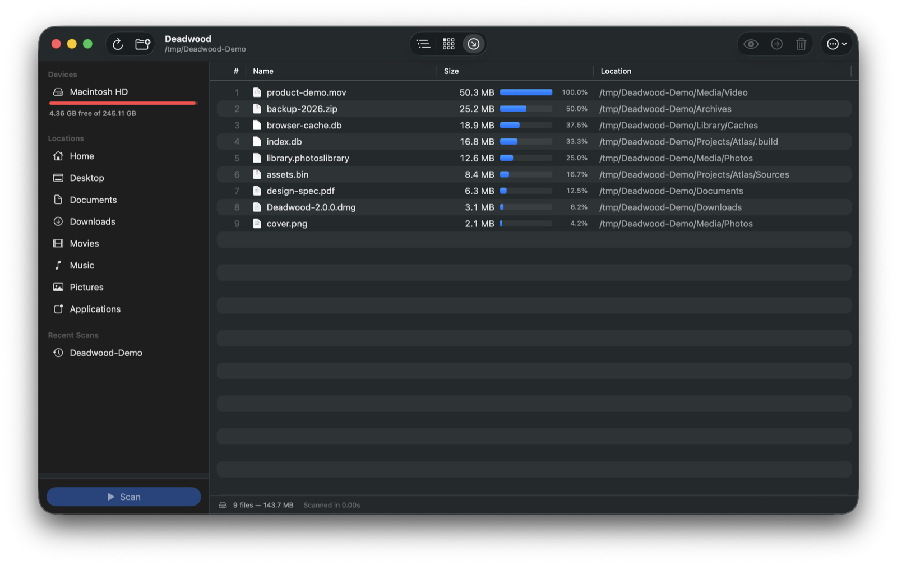

# Deadwood

**Find the dead weight on your disk.**

Deadwood is a fast, native macOS disk-space analyzer built with SwiftUI. Scan any drive or folder and see exactly what is eating your storage — in three complementary views — then clear it out safely.

  

## Screenshots

| Tree view | Treemap | Largest Files |
|-----------|---------|---------------|
|  |  |  |

## Features

- **Parallel scanner** — walks directories concurrently with structured concurrency and bounded filesystem workers. Progress (items, bytes, current path, elapsed) streams live while you wait, and cancellation is checked between directory reads and while processing large listings.
- **Tree view** — a native hierarchical `Table` with sortable columns: name, size, % of parent (with bar), item count, date modified, and kind. Real Finder file icons included.
- **Treemap view** — a squarified treemap of the scanned tree. Hover for details, click to select, double-click to drill into a folder, and climb back out with the breadcrumb.
- **Largest Files view** — the top 100 space consumers in one flat, ranked list.
- **Quick Look** — press **Space** (or **⌘Y**) for the native preview panel. Arrow keys step through neighbouring items and the selection follows along, just like Finder; a multi-selection previews within itself.
- **Safe cleanup** — reveal in Finder, copy path, move to Trash (⌫), or permanently delete (with confirmation). Multi-select works everywhere, sizes update in place, and deleting a child updates every ancestor's total.
- **Honest sizes** — counts allocated on-disk size (not logical length), includes hidden files by default, never follows symlinks, and never crosses volume boundaries. Every directory identity is scanned exactly once, so firmlinks and synthetic filesystem mirrors can never double-count the disk.
- **Permission-aware** — unreadable folders are counted and listed, with a one-click jump to the Full Disk Access pane in System Settings.
- **Fixed locations panel** — all mounted volumes with capacity bars (auto-refreshes on mount/unmount), standard user folders, and your recent scans. Double-click anything to scan it.

## Install

Grab `Deadwood-x.y.z.dmg` from [Releases](../../releases), open it, and drag Deadwood into Applications.

Local builds are ad-hoc signed by default. Release builds can be Developer ID
signed and notarized using the environment variables documented below.

## Build from source

Requirements: macOS 14 (Sonoma) or later, Xcode Command Line Tools (`xcode-select --install`).

```bash
swift run                  # quick development run
./build-app.sh             # dist/Deadwood.app (release, icon, ad-hoc signed)
./scripts/make-dmg.sh      # dist/Deadwood-2.0.0.dmg installer
swift test                 # scanner + treemap test suite
```

`VERSION` is the single source of truth for the app and DMG version. To create
a distributable signed and notarized installer:

```bash
export DEADWOOD_SIGNING_IDENTITY="Developer ID Application: Your Name (TEAMID)"
export DEADWOOD_NOTARY_PROFILE="deadwood-notary"
./build-app.sh
./scripts/make-dmg.sh
```

The notary profile must already exist in Keychain (created with
`xcrun notarytool store-credentials`). CI builds and tests every push and pull
request on a GitHub-hosted macOS runner.

## Usage

1. Pick a drive or folder in the left panel (or press **⌘O** to choose any folder), then hit **Scan**.
2. Switch between **Tree**, **Treemap**, and **Largest Files** with the toolbar picker or **⌘1–⌘3**.
3. Select anything, then preview it with **Space**, reveal it in Finder, copy its path, or move it to the Trash straight from the toolbar, the right-click menu, or the **⌫** key.
4. If the status bar reports skipped items, grant Deadwood **Full Disk Access** and rescan for complete results.

Scan options live in **Settings (⌘,)** and in the toolbar's **⋯** menu:

- **Include hidden files** (on by default) — so totals match real disk usage.
- **Show package contents** (off by default) — expand apps/bundles into their inner files; their total size is always counted either way.

## Architecture

```
Sources/Deadwood/
├── DeadwoodApp.swift           # App scene, menu commands, Settings
├── Models/
│   ├── FileNode.swift          # @Observable tree node; URL derived from ancestry (low memory)
│   ├── ScanModels.swift        # ScanOptions / ScanProgress / ScanResult / ScanTarget
│   └── DriveInfo.swift         # Mounted-volume enumeration
├── Services/
│   ├── DiskScanner.swift       # Parallel recursive scanner (TaskGroup fan-out, throttled progress)
│   ├── FileActions.swift       # Finder reveal, open, trash, delete, pasteboard
│   └── IconCache.swift         # Finder icons cached per file type
├── ViewModels/
│   └── AppModel.swift          # @MainActor single source of truth (scan lifecycle, selection, sort, deletion)
├── Views/
│   ├── ContentView.swift       # Window scaffold, toolbar, alerts
│   ├── SidebarView.swift       # Drives, locations, recent scans
│   ├── FileTreeTable.swift     # Sortable hierarchical Table
│   ├── TreemapView.swift       # Interactive squarified treemap (Canvas)
│   ├── LargestFilesView.swift  # Top-100 list
│   └── StateViews.swift        # Empty state, scan progress, status bar
└── Utilities/
    ├── TreemapLayout.swift     # Pure squarified layout algorithm
    └── ByteFormatter.swift     # Size/count/duration formatting
```

Design notes:

- **Single ownership over locks.** Each subtree is built by exactly one task and handed to the main actor once, so the scanner needs no per-node synchronization; the only locks in the app guard the progress counter and the visited-directory set.
- **Nodes store names, not URLs.** Full paths are derived from the ancestor chain on demand, saving hundreds of MB on multi-million-file scans.
- **Blocking IO stays off the cooperative pool.** Directory reads run on a dedicated Dispatch queue, so a scan wedged on a dead network mount can never starve the app.
- **One source of truth.** `AppModel` owns all state; views bind to it directly — selection stays in sync across the tree, treemap, and largest-files views.

## Known limitations

- Hard-linked files are counted once per link (same as Finder).
- APFS clone files are counted at full size for each clone.
- Changing scan options applies to the next scan, not retroactively.

## Support

The sidebar's **Donate** button opens the project's
[crypto support page](https://galilei13.github.io/deadwood/). Donation addresses
are configured in [`docs/support-config.js`](docs/support-config.js); verify every
address and network before publishing it. Donations are optional and do not unlock
features.

## License

[MIT](LICENSE)
